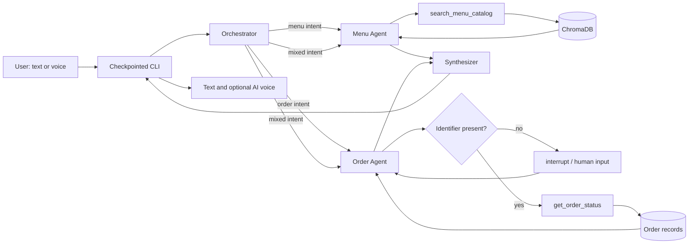

# SnackStack

An agentic food-ordering assistant built to demonstrate production-minded AI
workflow engineering—not just prompt-and-response chat.

SnackStack uses a typed LangGraph state machine to route customer requests to
specialist agents, ground answers in deterministic tools and vector retrieval,
pause safely for missing information, and combine parallel results into one
response. It ships with a checkpointed CLI plus optional speech input and
AI-generated voice output.

## Why this project matters

Most assistant demos hide orchestration inside one large prompt. SnackStack
makes the workflow explicit and inspectable:

- **Structured routing:** a Pydantic schema constrains the orchestrator to known
  agent destinations.
- **Specialized agents:** menu discovery and order support have separate
  prompts, tools, and state outputs.
- **Grounded tool use:** menu recommendations come from Chroma similarity
  search; order status comes from exact identifier lookup.
- **Bounded autonomy:** tool-calling loops are capped at five iterations and
  return controlled fallback responses.
- **Human in the loop:** LangGraph `interrupt()` pauses an incomplete order
  request and resumes from its checkpoint after the user supplies an ID.
- **Parallel-ready synthesis:** independent agent outputs occupy distinct state
  fields and can be merged by a dedicated synthesizer.
- **Multimodal interface:** microphone input is transcribed with Whisper and
  responses can be rendered as WAV speech.

## Architecture



### Request lifecycle

1. The CLI creates a conversation-specific `thread_id` for checkpointing.
2. The orchestrator returns validated agent destinations and a routing reason.
3. Specialist agents bind only the tools relevant to their responsibility.
4. Tool results are returned to the requesting model as correlated
   `ToolMessage` objects.
5. Missing order identifiers suspend execution instead of inviting the model
   to guess.
6. The synthesizer produces the final customer-facing response.

## Engineering decisions

| Concern | Implementation | Why |
| --- | --- | --- |
| Workflow control | LangGraph `StateGraph` and `Command` | Makes routing and state transitions explicit |
| Routing contract | Pydantic structured output | Prevents arbitrary or misspelled destinations |
| Shared state | `TypedDict` `StackState` | Documents the data contract between nodes |
| Menu grounding | OpenAI embeddings and persistent ChromaDB | Supports semantic requests such as dietary or ingredient preferences |
| Order grounding | Exact ID, tracking ID, or email lookup | Avoids unreliable semantic matching for transactional data |
| Recovery | `interrupt()` plus `InMemorySaver` | Pauses safely when required user input is missing |
| Agent safety | Five-iteration tool limit | Bounds cost and prevents unending tool loops |
| Composition | Dedicated response fields and synthesizer | Supports fan-out without concurrent writes to one state key |
| Voice I/O | `sounddevice`, `soundfile`, Whisper, and OpenAI TTS | Keeps capture, encoding, transcription, synthesis, and playback modular |

## Technology stack

- Python 3.11+
- LangGraph
- LangChain
- Pydantic
- OpenAI chat, embeddings, Whisper, and text-to-speech APIs
- ChromaDB via `langchain-chroma`
- `sounddevice` and `soundfile`
- Ruff for linting and formatting

## Project structure

```text
SnackStack/
├── agents/
│   ├── orchestrator.py    # Typed intent routing
│   ├── menu_agent.py      # Retrieval-backed menu specialist
│   ├── order_agent.py     # Order specialist with interrupt handling
│   ├── synthesizer.py     # Parallel-response consolidation
│   └── prompts.py         # Role and grounding policies
├── data/
│   ├── menu.py            # Menu records → LangChain Documents
│   └── orders.py          # Deterministic order lookup
├── tools/
│   ├── rag.py             # Persistent Chroma collection and retriever
│   ├── menu_tools.py      # Semantic menu-search tool
│   └── order_tools.py     # Exact order-status tool
├── voice/
│   ├── recorder.py        # Microphone → WAV → Whisper
│   └── speaker.py         # OpenAI TTS WAV → playback
├── config.py              # Model and embedding factories
├── state.py               # Shared typed graph state
├── graph.py               # Graph construction and compilation
└── main.py                # CLI, checkpoints, interrupts, and voice flags
```

## Quick start

### 1. Create an environment

```bash
git clone https://github.com/gcward18/SnackStack.git
cd SnackStack

python -m venv .venv
source .venv/bin/activate
pip install -e .
```

### 2. Configure credentials

Create a local `.env` file:

```dotenv
OPENAI_API_KEY=your_openai_api_key
CHROMA_DIRECTORY=./chroma_db
```

`.env` and the local Chroma database are excluded from version control.

### 3. Build the menu index

```bash
python -m tools.rag
```

### 4. Run SnackStack

Interactive text mode:

```bash
python main.py
```

One-shot query:

```bash
python main.py --ask "What is the status of ORD-201?"
```

Voice input:

```bash
python main.py --voice
```

Voice input and AI-generated voice output:

```bash
python main.py --voice --voice-out
```

Speak the result of a one-shot query:

```bash
python main.py --ask "Show me vegetarian Indian dishes" --voice-out
```

Voice mode records five-second microphone turns. The CLI clearly identifies
spoken output as AI-generated.

## Example workflows

### Grounded order lookup

```text
$ python main.py --ask "What is the status of ORD-201?"

The status of order ORD-201 is Out for Delivery. The item is Butter Chicken
and the tracking ID is SS201TRK.
```

### Human-in-the-loop recovery

```text
You: Where is my order?
Please provide your order ID, tracking ID, or customer email.
> ORD-203

SnackStack: Order ORD-203 is currently Preparing.
```

### Semantic menu retrieval

```text
You: I want a highly rated vegetarian Indian dish under ₹250

SnackStack: Paneer Tikka is a strong match at ₹199 with a 4.8 rating.
```

## Agent and tool boundaries

The project deliberately separates probabilistic reasoning from deterministic
operations:

- The **orchestrator** decides which capabilities a request needs.
- The **menu agent** interprets natural-language preferences, but its factual
  menu data must come from the retriever.
- The **order agent** can reason about a request, but it cannot invent an
  identifier or status.
- The **order tool** performs an exact case-insensitive lookup across order ID,
  tracking ID, and email.
- The **synthesizer** receives no tools and may only consolidate grounded agent
  outputs.

This division keeps LLMs focused on language and routing while ordinary Python
handles validation, lookup, persistence, and control flow.

## Development checks

Format the project:

```bash
ruff format .
```

Run static checks:

```bash
ruff check .
python -m compileall -q .
```

Inspect CLI options without making an API call:

```bash
python main.py --help
```

## Current trade-offs and next steps

SnackStack is intentionally scoped as a local portfolio application. The next
production-oriented improvements would be:

- Replace `InMemorySaver` with a durable SQLite or PostgreSQL checkpointer.
- Add unit tests with fake chat models and deterministic tool-call fixtures.
- Add LangSmith traces and evaluations for routing and retrieval quality.
- Introduce authorization before exposing customer order details by email.
- Replace in-memory order records with a transactional datastore.
- Version the menu index and add incremental re-indexing.
- Skip the synthesis LLM call when only one specialist responds to reduce
  latency and token usage.
- Package application code under a conventional `src/snackstack/` layout.

## What this demonstrates

This project is evidence of hands-on experience with:

- Designing multi-agent workflows as explicit state machines
- Building structured LLM control planes with validated outputs
- Implementing bounded tool-calling loops
- Integrating vector search without using it for inappropriate exact-match data
- Managing parallel state updates and response synthesis
- Building resumable human-in-the-loop interactions
- Separating domain data, tools, agents, orchestration, and interfaces
- Adding multimodal I/O while preserving a testable text path
- Making latency, privacy, reliability, and cost trade-offs visible

---

Built as a focused demonstration of agent orchestration, retrieval engineering,
human-in-the-loop control, and multimodal application design.
